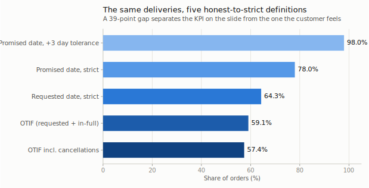
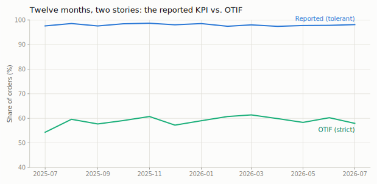
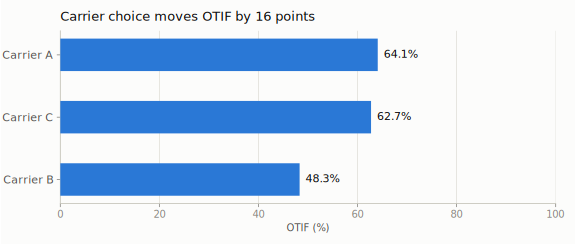
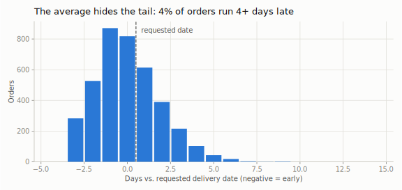
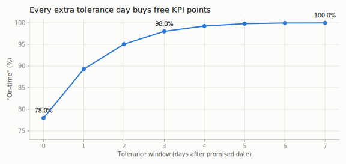

# OTIF Analytics — how honest is your on-time delivery KPI?

> The delivery KPI on the management slide says **98.0%**.
> Measured the way the customer actually experiences it, the same orders score **59.1%**.
> This project shows, step by step, where those **39 points** hide — and ships a Streamlit tool so you can run the same audit on your own order data.

Most companies don't have a delivery problem *and* a measurement problem — they have a measurement problem that hides the delivery problem. I designed this study around the five definition choices that quietly inflate "on-time" numbers: which date you anchor to, how much tolerance you grant, whether partial shipments count, and what happens to cancelled orders.

## The metric ladder

Same 4,000 orders. Five definitions, from the one on the slide to the one the customer feels:



| # | Definition | Result | What changed |
|---|------------|--------|--------------|
| 1 | Promised date, ±3-day tolerance | **98.0%** | The reported KPI |
| 2 | Promised date, strict | **78.0%** | Tolerance window removed: −20.0 pts |
| 3 | *Requested* date, strict | **64.3%** | Sales padding exposed (promises average +0.7 days vs. what the customer asked): −13.7 pts |
| 4 | **OTIF** — requested date + complete order | **59.1%** | Partial shipments counted: −5.2 pts |
| 5 | OTIF incl. cancellations | **57.4%** | Cancelled orders stop hiding: −1.7 pts |

Each rung is a *policy choice*, not a technicality. If your contract says OTIF and your dashboard says rung 1, the gap eventually surfaces — usually in a customer QBR, at the worst possible moment.

## What else the same data shows

**The two stories, month by month.** The reported line and the OTIF line never converge — the gap is structural, not seasonal:



**Carrier choice moves OTIF by 15.8 points.** One carrier drags the whole network down — invisible in the tolerant metric, obvious in OTIF:



**The average hides the tail.** Average lateness is 0.0 days — sounds perfect. But 4.3% of orders run 4+ days late, and those are the ones customers remember:



**Every tolerance day buys free KPI points.** This curve is why "on-time" definitions drift upward over the years — each +1 day of tolerance is a cheap win on the slide:



## Run it on your own data

```bash
pip install -r requirements.txt
python generate_data.py     # regenerates the full 4,000-order dataset (seeded)
python analysis.py          # recomputes all metrics and charts
streamlit run app.py        # interactive explorer
```

The Streamlit app accepts your own CSV. Expected columns:

| Column | Type | Notes |
|--------|------|-------|
| `order_id` | text | unique |
| `requested_delivery_date` | date | what the customer asked for |
| `promised_delivery_date` | date | what was confirmed |
| `actual_delivery_date` | date | empty if cancelled |
| `lines_total` | int | order lines |
| `lines_delivered_complete` | int | lines delivered complete |
| `status` | text | `delivered` / `cancelled` |
| `carrier` | text | optional — enables the carrier table |

## About the data

**Fully synthetic.** No real company data is used anywhere. The generator (`generate_data.py`, seeded for reproducibility) builds a one-year order book for a fictional mid-size distributor and injects the failure patterns I've repeatedly seen in real operations: sales padding on promise dates, one systematically weak carrier (the fictional "Carrier B"), month-end dispatch congestion, and partial shipments concentrated in one product family. A 300-row sample ships with the repo; the full file regenerates in seconds.

## Method notes

- **Requested date is the honest anchor.** The customer plans against what they asked for, not what your order desk confirmed. Padding the promise moves the metric, not the experience.
- **In-full belongs at order level.** A 9-of-10-lines delivery is not "90% on-time" — the customer's production line is still stopped. Line-level fill rate is a separate, complementary metric.
- **Tolerance windows should be a contract term, not a dashboard default.** If you must use one, publish it next to the number.
- **Report cancellations alongside OTIF.** Orders that quietly disappear from the denominator flatter the metric.

## Roadmap

- [ ] Root-cause pareto: late reasons by category / region / month
- [ ] Cost-of-lateness estimator (penalty clauses, expedited freight)
- [ ] Power BI template for the same metric ladder
- [ ] Türkçe rapor şablonu

## 🇹🇷 Türkçe özet

Yönetim sunumundaki "zamanında teslimat" metriği %98 gösterirken, müşterinin yaşadığı gerçek (OTIF: istenen tarihte + eksiksiz) %59 olabilir. Bu çalışma aradaki farkın tam olarak nerede saklandığını beş adımlık bir metrik merdiveniyle gösteriyor; kendi sipariş verinizi yükleyip aynı denetimi yapabileceğiniz bir Streamlit aracı içeriyor. Veri tamamen sentetiktir.

## About

Designed and built by **[Eren Gülmez](https://www.linkedin.com/in/erengulmez)** — industrial engineer, İstanbul. I design the measurement system first, then direct modern tooling to ship it; the metric definitions and the business interpretation above are the actual product — the code is the vehicle.

Part of an open industrial-engineering toolkit → **[awesome-industrial-engineering](https://github.com/gulmezeren2-byte/awesome-industrial-engineering)**

## License

[MIT](LICENSE)
